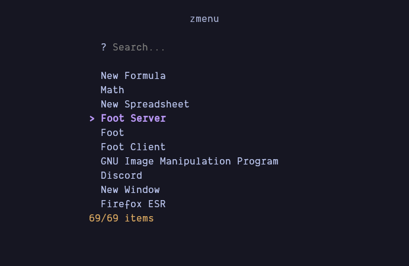

# zmenu

A simple Zig application launcher.

I've always loved using a terminal. Most of applications launcher are GUI apps. Why not use a terminal one?

In tiled wayland compositor or tiled window manager, you'll only need a terminal!.

## Roadmap:
- [x] TUI
- [x] application information parser
- [x] application runner
- [x] detect default terminal and open terminal apps in it
- [ ] config options
- [ ] dmenu mode
