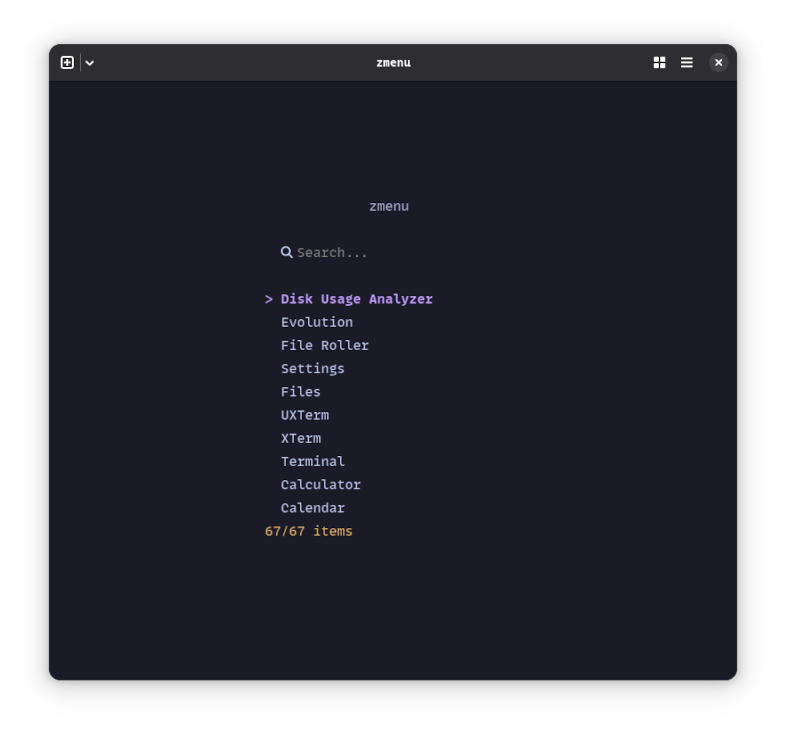

# zmenu

## Description

A simple Zig application launcher.

I've always loved using a terminal. Most of applications launcher are GUI apps. Why not use a terminal one?

In tiled wayland compositor or tiled window manager, all you need is a terminal!

## Documentation:

- TODO.
